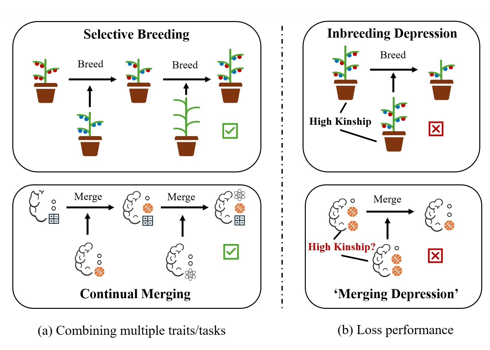

# Merge Assistant Toolkit


---

## Overview

Model merging provides a novel paradigm to leverage information from multiple models without the need of additional training. The recent development of a model merging toolkit allows non-experts to conduct model merging experiments, leading to a trend of merging models on the Hugging Face Open LLM Leaderboard. 

For now, the model merging community has built powerful models through multiple merge steps. This process is akin to artificial selection, a concept in biology in which humans consciously select for or against particular features in organisms.


However, the reasons behind the success of this process remain unknown, resulting in numerous trial-and-error attempts for slight performance improvements.



Inspired from the evolutionary biology, our project explore using information about capabilities acquired during post pre-training (e.g., fine-tuning, merging), which we called **'model kinship'**, to seek for more efficient methods for model optimization.

This toolkit provides a simple way to calculate metrics that can be possibly used as the **'model kinship'** in model merging.

---

## Installation

```bash
git clone https://github.com/zjunlp/merge.git
cd merge
pip install -e .
```

---

## Usage

```bash
merge_cal model-1 model-2 model-base metrics
e.g.
merge_cal OpenPipe/mistral-ft-optimized-1218 mlabonne/NeuralHermes-2.5-Mistral-7B mistralai/Mistral-7B-v0.1 ed
```

---

## Supported Metrics:
- Cosine Similarity - cs
- Pearson Correlation Coefficient - pcc
- Euclidean Distance - ed

Merged Models in Our Experiments:
https://huggingface.co/PotatoB
