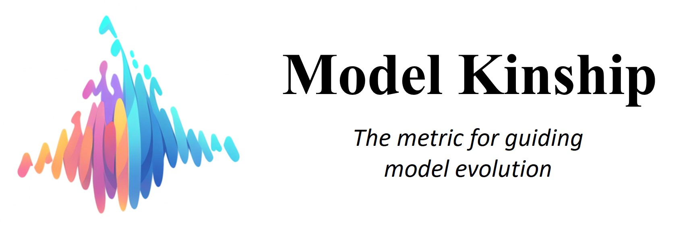
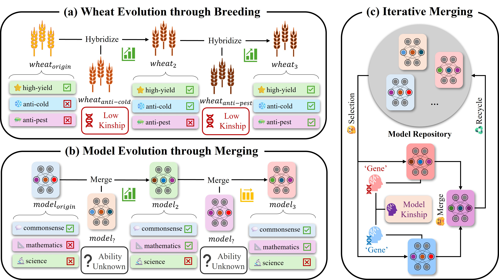

<div align="center">

<h1 align="center"> Exploring Model Kinship for Merging LLMs </h1>
<b align="center">The degree of
similarity or relatedness between LLMs, analogous to biological evolution</b>


  <a href="https://arxiv.org/abs/2410.12613">📄arXiv</a> •
  <a href="https://potatobearp.github.io/publication/modelkinship/">📒 Blog</a>•
  <a href="https://huggingface.co/collections/zjunlp/model-kinship-670d59c69bf3598b0bed1cbd">🤗 HF</a> •
  <a href="https://notebooklm.google.com/notebook/720d2f64-fdd2-47e2-a086-7870b8db23e5/audio">🎧NotebookLM Audio</a>


[](https://opensource.org/licenses/MIT)

<a href="https://colab.research.google.com/drive/141VAI89emgSIcwkswATEXSEENoAMywTO?usp=sharing">
        
</a>
</div>

We introduce [Model Kinship](https://arxiv.org/pdf/2410.12613), the metric for degree of similarity or relatedness between LLMs for continual model merging, analogous to biological evolution. 

Currently, we support **Model Kinship** with 3 Similarity Metrics, others will be supported in the future. 

---

## Table of Contents

- [Overview](#overview)
- [Installation](#installation)
- [Usage](#usage)
- [Reproduction](#reproduction)
- [Supported Metrics](#supported-metrics)
- [Notebook](#notebook)
- [Acknowledgement](#acknowledgement)
- [Citation](#citation)

## Overview

Model merging provides a novel paradigm to leverage information from multiple models without the need of additional training.  Recently, the development of a model merging toolkit has enabled non-experts to conduct merging experiments, spurring a trend of model merging on the Hugging Face Open LLM Leaderboard.

Currently, the model merging community has built powerful models through iterative merging steps. This process resembles artificial selection—a concept from biology in which humans deliberately select for or against specific traits in organisms.



However, the reasons behind the success of this process remain unknown, resulting in numerous trial-and-error attempts for slight performance improvements.
Drawing inspiration from evolutionary biology, our project examines the weight changes that occur during post pre-training stages (e.g., fine-tuning, merging). We propose **Model Kinship**, a metric that evaluates the relatedness between two models by calculating the similarity of their weight changes, analogous to genetic variance in inheritance. In our paper we show that **Model Kinship** can be used for optimising the merging strategy.

This toolkit provides a simple way to calculate **Model Kinship** for model merging.

---

## Installation

```bash
git clone https://github.com/zjunlp/ModelKinship.git
pip install -e ./ModelKinship
```

---

## Usage

```bash
# Input Format
merge_cal model-1 model-2 model-base metrics

# Calculate Model Kinship based on Euclidean Distance (CPU)
merge_cal OpenPipe/mistral-ft-optimized-1218 \
mlabonne/NeuralHermes-2.5-Mistral-7B \
mistralai/Mistral-7B-v0.1 \
ed

# Multiple Calculation (CPU)
merge_cal OpenPipe/mistral-ft-optimized-1218 \
mlabonne/NeuralHermes-2.5-Mistral-7B \
mistralai/Mistral-7B-v0.1 \
cs,pcc,ed
```
---

## Reproduction
To reproduce our experiments, both an evaluation toolkit and a merging toolkit for large language models are required. We recommend using the following tools:

- [lm-evaluation-harness by EleutherAI](https://github.com/EleutherAI/lm-evaluation-harness)
- [mergekit by arcee-ai](https://github.com/arcee-ai/mergekit)

Merged Models in Our Experiments are Open Access:
- [Merged Models Repository](https://huggingface.co/PotatoB)

---

## Supported Metrics:
- Cosine Similarity - cs
- Pearson Correlation Coefficient - pcc
- Euclidean Distance - ed

---

## Notebook:

To conduct iterative merging experiments, you can use following notebook for a quick start.

- [Notebook for Iterative Merging](https://colab.research.google.com/drive/141VAI89emgSIcwkswATEXSEENoAMywTO?usp=sharing)

This notebook includes 3 main functions:
- Selection - calculate the model kinship to predict the potential benefit of providing merge.
- Merging - merge the providing models.
- Recycling - upload the merged model (evaluation is optional).
---

## Acknowledgement

We would like to express our gratitude to the developers and contributors of the following external toolkits, which were instrumental in the success of our research on model merging and kinship analysis:

- [lm-evaluation-harness by EleutherAI](https://github.com/EleutherAI/lm-evaluation-harness) for providing a comprehensive evaluation framework for large language models.
- [mergekit by arcee-ai](https://github.com/arcee-ai/mergekit) for offering an essential toolkit for model merging experiments.

These toolkits have significantly contributed to our ability to conduct and reproduce large-scale experiments, and their open-source availability has been invaluable to the broader research community.

---

## Citation:

```bash
@misc{hu2024exploringmodelkinshipmerging,
      title={Exploring Model Kinship for Merging Large Language Models}, 
      author={Yedi Hu and Yunzhi Yao and Ningyu Zhang and Shumin Deng and Huajun Chen},
      year={2024},
      eprint={2410.12613},
      archivePrefix={arXiv},
      primaryClass={cs.CL},
      url={https://arxiv.org/abs/2410.12613}, 
}
```